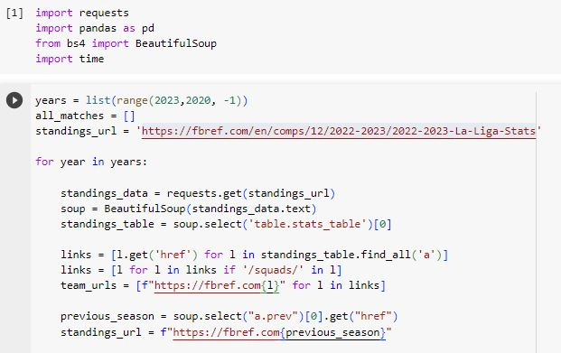
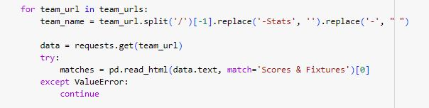

# Scraped-match-stats-EDA
## Exploratory Data Analysis of Scraped La Liga Football Matches using Python

## 1. Introduction, Aims & Objectives

### 1.1 Introduction & Background

The Campeonato Nacional de Liga de Primera División,  commonly known as the Primera División, or La Liga is the men's top professional football division of the Spanish football league system.
Since its inception, a total of 62 teams have competed in La Liga. Nine teams have been crowned champions, with Barcelona winning the inaugural La Liga and Real Madrid winning the title a record 35 times. Barcelona is the most recent winner, having won the 2022–23 edition [1](https://en.wikipedia.org/wiki/La_Liga). 

We will be scraping football matches data for the past 3 seasons in view of exploring the relationship between the outcome of a football match (win, lose, or draw) and a set of variables describing the game actions.

### 1.2 Aims & Objectives
Within this project, I would like to explore the following:
- Scraping and Parsing HTML links from a website
- Extracting stats from the data using Pandas
- Cleaning and Merging scraped data from different tables and seasons
- Exploring game actions and how they relate to the outcomes of football matches

### 1.3 Steps of the project

1. Extract dataset from La Liga's [fbref.com](https://fbref.com/en/comps/12/2022-2023/2022-2023-La-Liga-Stats) webpage, scraping data for the past 3 seasons
2. Clean and Merge the needed datasets with relevant game actions
3. Preprocess data and engineer additional features for analysis
4. Exploratory data analysis
5. Conclusion

### 2. Data collection
We opted for [fbref.com](https://fbref.com/en/comps/12/2022-2023/2022-2023-La-Liga-Stats) as it was easy to extract data for past seasons as well as some game actions that were of interest to us. Although the data was littered across several web pages and tables, it was just what we needed to explore these relationships further. You can a more detailed procedure of the web scraping process [here](https://medium.com/@ch1bu20/web-scraping-la-liga-football-matches-with-python-cabad37d1f86).

As you know, every season three teams are relegated, and the same number is also promoted into the league. These were taken into consideration using a try & except block, while merging the datasets. Also, to avoid being thrown out from the webpage while scraping the data, 
we had to delay the iterations by a few seconds.

### 3. Data Cleaning
From individual teams on the webpage, we were able to get the following tables: 'Scores and Fixtures', 'Shooting', and 'Defensive actions'. Only a few columns of interest were picked from the shooting and defensive actions tables. We merged these tables using the 'date' column, the team names were pre-processed and only games in the La Liga competition were selected.

Upon merging all extracted tables and data, we save our Dataframe in a CSV file for onward analysis. 

